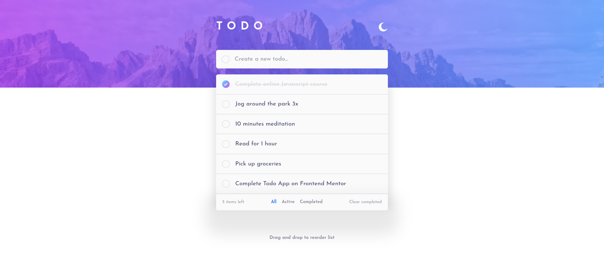

# Frontend Mentor - Todo app solution

This is a solution to the [Todo app challenge on Frontend Mentor](https://www.frontendmentor.io/challenges/todo-app-Su1_KokOW). Frontend Mentor challenges help you improve your coding skills by building realistic projects. 

## Table of contents

- [Overview](#overview)
  - [The challenge](#the-challenge)
  - [Screenshot](#screenshot)
- [My process](#my-process)
  - [Built with](#built-with)
  - [What I learned](#what-i-learned)
  - [Continued development](#continued-development)
- [Author](#author)
**Note: Delete this note and update the table of contents based on what sections you keep.**

## Overview

### The challenge

Users should be able to:

- View the optimal layout for the app depending on their device's screen size
- See hover states for all interactive elements on the page
- Add new todos to the list
- Mark todos as complete
- Delete todos from the list
- Filter by all/active/complete todos
- Clear all completed todos
- Toggle light and dark mode
- **Bonus**: Drag and drop to reorder items on the list

### Screenshot

### Links

- Solution URL: [Frontendmentor link](https://www.frontendmentor.io/solutions/todo-list-with-theme-changing-ms436MmRzx)
- Live Site URL: [Cloudflare live site](https://todo-list-6xg.pages.dev/)

## My process

### Built with

- Semantic HTML5 markup
- CSS custom properties
- Flexbox
- CSS Grid
- Mobile-first workflow
- [React](https://reactjs.org/) - JS library
- [FramerMotions](https://motion.dev/) - Animation Library
- [DndKit](https://docs.dndkit.com/) - Drag and Drop

### What I learned

I learned a lot of things about drag and drop functionalites and framer motion (this is my first time animating with javascript!!)

### Continued development

I will read more about drag and drop (dnd kit library docs) and framer motion (animation library). My goal is to implement it in my time table software

## Author

- Frontend Mentor - [@Gloryjaw](https://www.frontendmentor.io/profile/Gloryjaw)
- Twitter - [@Gloryjaw](https://www.twitter.com/Gloryjaw)

